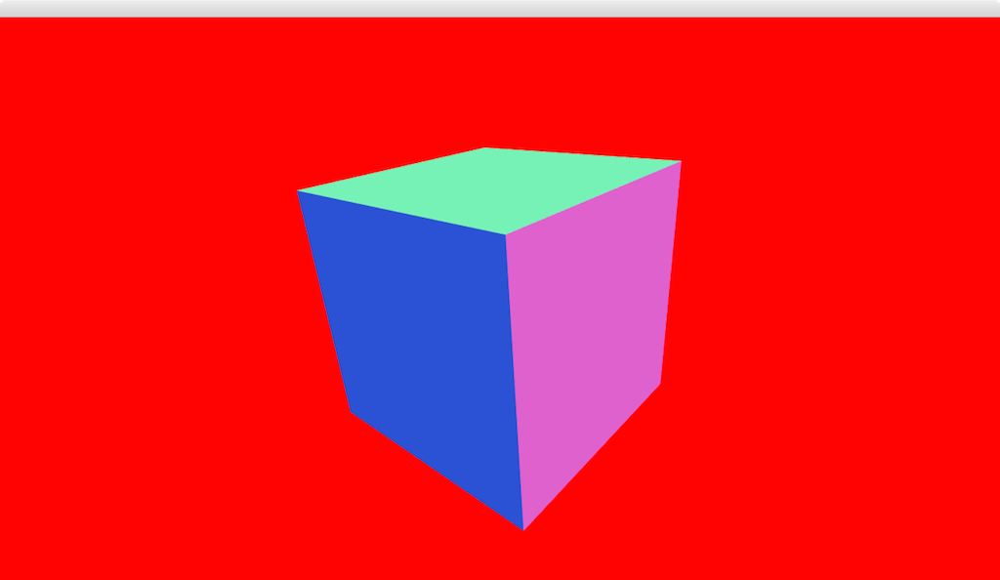
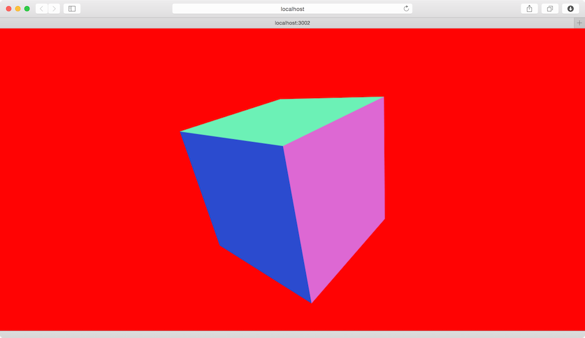

WORK IN PROGRESS

# Pex 

Pex is a javascript 3d library / engine allowing for seamless development between Plask and WebGL in the browser.


## Introduction

### What is pex?

Pex (plask extentions) is a collection of JavaScript modules the combination of which becomes a powerful 3D graphics library for the desktop and the web.

There are a few main points you need to understand to grok what Pex is all about:

1. Pex is originally based on [Plask](http://plask.org). Plask is a JavaScript multimedia programming environment for the desktop. Plask is a magical bridge between your favourite JavaScript world and a collection of C++ libraries for 3D graphics, audio and video playback and others.
But Plask, essentially, is a node.js program - meaing...

2. Pex is node.js code, too. You download the modules from npm, require them and you write 3D code. Naturally, you can use any other module from the enormous npm ecosystem in your program. 

3. As aforementioned Plask runs as a desktop application. Pex extends it to the web using by abstracting application window and WebGL context creation. In other words, you can run your Pex program as a standalone desktop application or directly in a browser that supports WebGL. No changes in the code whatsoever. To top the cake, you can run it on iOS below version 8.0 using [Ejecta](https://github.com/phoboslab/ejecta).

4. And finally, to answer your question - yes, Pex could be considered an alternative to Three.js. We are big fans of Three but we believe that every software or library should have an alternative. If you want to write WebGL, it should not mean you must use Three. Variety in every ecosystem is vital. We will expand on the technical differences later. 

### How to use

This seems like a lot of text but don't be scared! I'ts really easy, especially if you have Node.js and npm installed.

1. As you already know, Pex uses Plask to run as a desktop application. To do this you will need to download Plask from here: [http://www.plask.org/](http://www.plask.org/). Plask is an awesome project so be sure to check out the source: [https://github.com/deanm/plask](https://github.com/deanm/plask).

2. You will need to install Node.js and npm. If you already have them - skip to the next step. Otherwise go to [http://nodejs.org/](http://nodejs.org/) for further instructions on how to install Node.js on your machine. 

3. There are a few ways to get pex up and running. All of the pex modules are on npm so you could for example install them one by one or put them in your package.json. You could also do:

		$ npm install pex
		
	which installs everything neceserry to run pex, generate new projects and documentation files.
		
	The next step would be to run:  

		$ pex init --help
	
	to list all options so you choose and run what you want or just:
	
		$ pex init exampleApp
		$ cd exampleApp
		$ npm install 
		
	Now all you have to do is either run: 
	
		$ npm run watch
		
	which launches a new browser tab with the example app and watches for changes in **main.js** (where your pex program is) or you run **main.js** in Plask. You can open the **index.html** document manually and while that would work just fine since your Pex source code needs to be browserified changing **main.js** and saving wouldn't change what you see. 
	
	You can usually use a gulp or grunt script instead of a npm script to watch and build **main.js** by adding the `-g --grunt` or `-u --gulp` flag when creating a new app with `pex init`. For more info check out: [Pex command line reference](#pex-command-line-reference).

4. Play around with the example! If you made it this far all you need to do now is dive into the amazing world of 3D graphics. The example app is a basic cube. But Pex comes with a lot more awesome examples so try them all out, copy pasta some code to make some neat stuff and dive into the docs. 

### Technical differences with Three.js

ThreeJS is focusing on simplifying your experience with WebGL by hiding the hard parts and exposing an API that's easy to start with. It has better community support, better tools import/export support and it's well tested, solid code that you can confortably use for your production projects.  

Pex has different goals in mind. It's simplifying coding but there is more boilerplate code to be written with aim to give you more controll over what and when is happening. While ThreeJS is targetting browsers, Pex primary target is Plask. It is written in a way that works in any WebGL capable browser out of the box and even on iOS with Ejecta. Pex is written in a modular way with CommonJS module format (the same as used in node.js libraries), ThreeJS is namespacing everything inside global Three object.

## Community 

### Contact and info

1. We love github issues! [http://github.com/vorg/pex/issues](http://github.com/vorg/pex/issues)
2. Follow [@marcinignac](http://twitter.com/marcinignac) on twitter
3. We are on **#pex** on freenode.

### Main contributors

[Marcin Ignac](https://github.com/vorg/) - main library code  
[Nick Nikolov](https://github.com/nicknikolov) - big part of v3 node modules rewrite, geom library contributions  
[Szymon Kaliski](https://github.com/szymonkaliski) - various build scripts improvements, examples contributor
[Dean McNamee](https://github.com/deanm) - author of Plask and core math code in pex  

### Projects showcase

[http://marcinignac.com/experiments/technology/webgl/](http://marcinignac.com/experiments/technology/webgl/)  
[http://marcinignac.com/projects/technology/webgl/](http://marcinignac.com/projects/technology/webgl/)  
[http://variable.io/](http://variable.io/) (All WebGL projects)  
[http://www.flickr.com/photos/marcinignac/sets/72157629801608107/](http://www.flickr.com/photos/marcinignac/sets/72157629801608107/)  

## Reference guide

### How to use Pex in Plask?

*Node: Plask is currently available only for OSX. If you are on Windows or Linux please jump to the next section [How to use Pex in a web browser?](#how-to-use-pex-in-a-web-browser)*

1. Download [Plask](http://plask.org).
2. Unpack .DMG and move **PlaskLauncher.app** to your `Applications` folder
3. Install [node.js](http://node.js).
4. Run the following commands in the terminal to install pex.
		
		npm install -g pex
		
5. Create your pex project.
		
		cd path/to/your/workspace/folder/
		pex init myFirstProject
		
6. Install dependencies.
		
		cd myFirstProject
		npm install
		
7. Open **PlaskLauncher.app**, click `File->Open` and choose generated `myFirstProject/main.js` file.

8. You should see a colorful cube. Drag your mouse to rotate it.

	

### How to use Pex in a web browser?

1. Install [node.js](http://node.js).
2. Run the following commands in the terminal to install pex.
		
		npm install -g pex
		
3. Create your pex project.
		
		cd path/to/your/workspace/folder/
		pex init myFirstProject
		
4. Install dependencies.
		
		cd myFirstProject
		npm install
		
5. Start compilation.

		npm run watch
		
6. The `watch` command should open a browser window and reload every time you make changes to `main.js` if not, click `myFirstProject/index.html`

6. You should see a colorful cube. Drag your mouse to rotate it.

	

### Basic Pex Example

```JavaScript
var sys = require('pex-sys');
var glu = require('pex-glu');
var materials = require('pex-materials');
var color = require('pex-color');
var gen = require('pex-gen');

var Cube = gen.Cube;
var Mesh = glu.Mesh;
var ShowNormals = materials.ShowNormals;
var PerspectiveCamera = glu.PerspectiveCamera;
var Arcball = glu.Arcball;
var Color = color.Color;
var Platform = sys.Platform;

sys.Window.create({
  settings: {
    width: 1280,
    height: 720,
    type: '3d',
    fullscreen: Platform.isBrowser ? true : false
  },
  init: function() {
    var cube = new Cube();
    this.mesh = new Mesh(cube, new ShowNormals());

    this.camera = new PerspectiveCamera(60, this.width / this.height);
    this.arcball = new Arcball(this, this.camera);
  },
  draw: function() {
    glu.clearColorAndDepth(Color.Red);
    glu.enableDepthReadAndWrite(true);
    this.mesh.draw(this.camera);
  }
});
```

### HTML File Structure

```HTML
<!doctype html>
<html lang="en">
<head>
  <meta charset="UTF-8">
  <title>Pex example</title>
  <script type="text/javascript" src="main.web.js"></script>
</head>
<body>
</body>
</html>
```

### Using with Sublime Texture2D

Opening and relaunching with PlaskLauncher is tedious so I [added a Build System](http://www.sublimetext.com/docs/build):

`Plask.sublime-build`

```JSON
{
  "cmd" : [
    "/path/to/PlaskLauncher.app/Contents/Resources/Plask.app/Contents/MacOS/Plask", 
    "$file"
  ]
}
```

Now you can select `Plask` from `Tools -> Build System -> Plask` and use `Cmd+B` to open currently edited JS file in Plask.

## Pex command line reference

### Installation

First install the script using npm:

    npm install -g pex

If that fails then your permissions might not be enough so try:

    sudo npm install -g pex

You will be asked to enter your password and things should go smoothly after that.

### Usage:

    pex init projectName [options]

### Options:

    -h, --help     output usage information
    -V, --version  output the version number
    -g, --grunt    add grunt build script
    -u, --gulp     add gulp build script
    -d, --docs     generate docs
    -f, --force    force on non-empty directory

